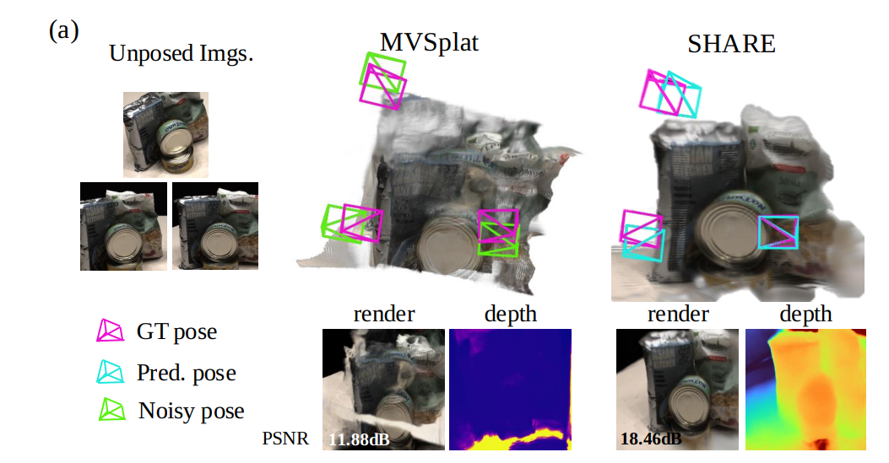

<p align="center">
  <h1 align="center">SHARE: Pose-Free 3D Gaussian Splatting <br> via Shape-Ray Estimation</h1>
  <p align="center">
    <a href="http://youngju-na.github.io/">Youngju Na*</a>
    &nbsp;·&nbsp;
    <a href="https://tykim5931.github.io/">Taeyeon Kim*</a>
    &nbsp;·&nbsp;
    <a href="https://zoomin-lee.github.io/">Jumin Lee</a>
    &nbsp;·&nbsp;
    <a href="https://qbhan.oopy.io/">Kyu Beom Han</a> <br>
    <a href="https://wkim97.github.io/">Woo Jae Kim</a>
    &nbsp;·&nbsp;
    <a href="https://sungeui.github.io/">Sung-Eui Yoon</a>
  </p>
  <h3 align="center">ICIP 2025 Best Student Paper Award</h3>
  <h3 align="center"><a href="https://arxiv.org/abs/2505.22978">Paper</a> | <a href="https://arxiv.org/abs/2505.22978">Project Page</a> </h3>
<!--   <div align="center">
    <a href="https://news.ycombinator.com/item?id=41222655">
      
    </a>
  </div> -->

<p align="center">
  
</p>

## 📰 News
- [ ] To Do: Release SHAREv2 (SHARE++), which adopts 3D foundation models in our pipeline (exp date: Jan 2025).
- [x] (10/21) Release checkpoint links
- [x] (10/21) Initial code release
- [x] (10/15) We received the ICIP 2025 Best Student Paper Award!

## 🧩 Installation

To get started, create a conda virtual environment using Python 3.10+ and install the requirements:

```bash
conda create -n share python=3.10
conda activate share
pip install torch==2.1.2 torchvision==0.16.2 torchaudio==2.1.2 --index-url https://download.pytorch.org/whl/cu118
pip install -r requirements.txt
```

## 📦 Datasets

SHARE is trained and evaluated on **DTU**, **BlendedMVS**, **RealEstate10K**, and **ACID** datasets.

- **DTU** and **BlendedMVS** datasets follow the preprocessing and download procedure of [VolRecon](https://github.com/IVRL/VolRecon).  
- **RealEstate10K** and **ACID** datasets follow the setup of [MVSplat](https://github.com/donydchen/mvsplat).

Please refer to the respective repositories for detailed dataset preparation instructions.

## 📥 Checkpoints

Pretrained SHARE model checkpoints are available via [google form](https://github.com/youngju-na/SHARE/)

The folder contains checkpoints for datasets trained on **DTU** and **RealEstate10K**, respectively.  

To use a checkpoint, download the relevant file and specify its path in your configuration or command line arguments as described in the training and evaluation scripts.

---


## 🚀 Running the Code

### Training and Evaluation

To run SHARE on each dataset, please refer to the command templates provided in the following files:

- `commands_dtu.md` – training and evaluation on **DTU / BlendedMVS**
- `commands_re10k.md` – training and evaluation on **RealEstate10K / ACID**
- `commands_cross_dataset.md` – for **cross-dataset evaluation**

All scripts are located in the project root and designed for easy reproducibility of the results reported in the paper.

---

## 📈 Cross-Dataset Evaluation

We provide ready-to-run scripts for evaluating cross-domain generalization using `commands_cross_dataset.md`.  
Please refer to the file for detailed instructions and dataset pair configurations.

## 🧪 Ablation Study
We provide ready-to-run scripts for ablation studies in `commands_ablation.md`.  
Please refer to the file for detailed instructions and experiment configurations.

---

## 🧠 BibTeX

```bibtex
@article{na2025share,
  title={SHARE: Pose-Free 3D Gaussian Splatting via Shape-Ray Estimation},
  author={Na, Youngju and Kim, Taeyeon and Lee, Jumin and Han, Kyu Beom and Kim, Woo Jae and Yoon, Sung-eui},
  journal={arXiv preprint arXiv:2505.22978},
  year={2025}
}
```

---

## 🙏 Acknowledgements

This project builds upon the foundations of  
[MVSplat (ECCV 2024)](https://github.com/donydchen/mvsplat) and [UFORecon (CVPR 2024)](https://github.com/youngju-na/UFORecon),  
and incorporates components adapted from these excellent works.  
We sincerely thank the original authors for their open-source contributions.

---
